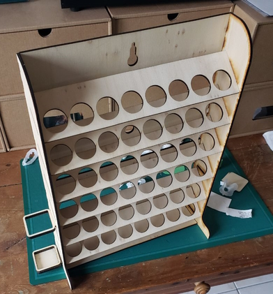

# PaintsRack

## Principle

Set of .dxf files to be used for laser cutting / CNC.
Simple rack to store paints and have them easily accessible while keeping the footprint as small as possible.
Suitable for Vallejo / Prince August / Army Painter paints. NOT suitable for Games Workshop / Citadel paints.

Inspired by thegoblintavern's works.

## Details
Today there is only plans for 3mm thick material (MDF, plywood, or whatever you want).
I'll add later plans a set of drawers compatible with this rack (as a base, maybe?).